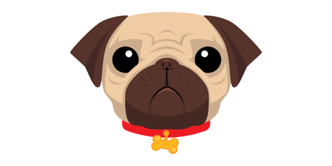
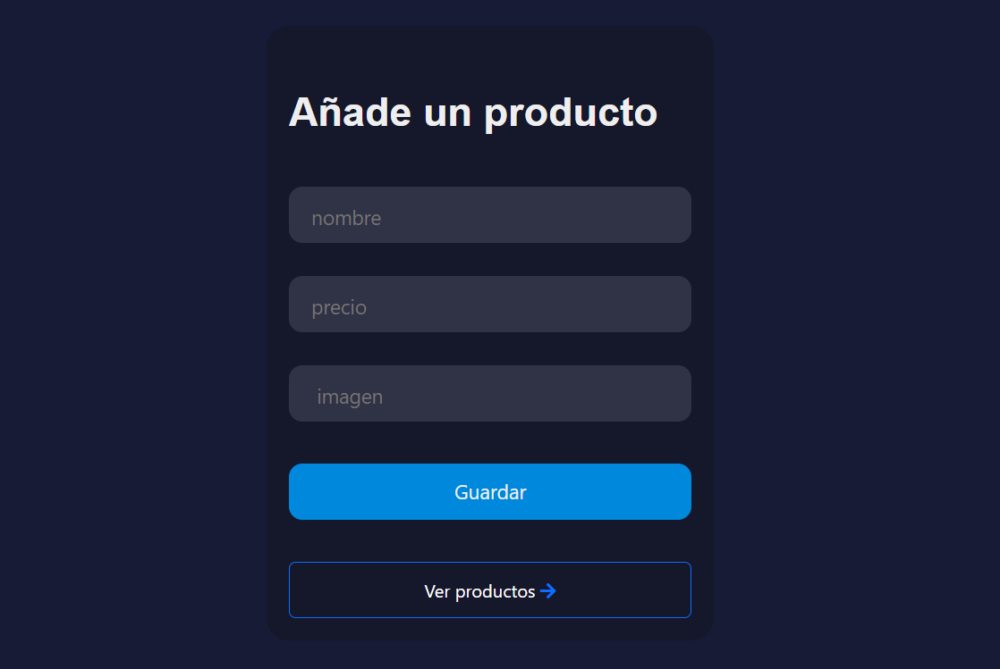
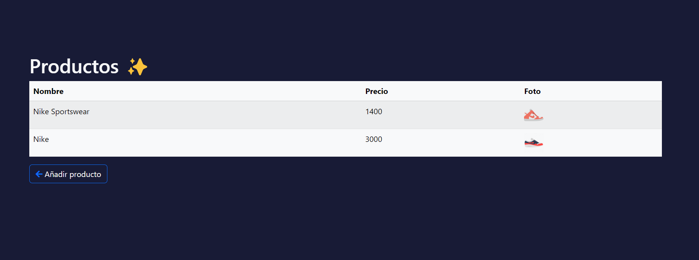

## Tecnologias
Este desafio implementa EJS, PUG Y HANDLEBARS 

  
   
  

## Preferencia
>Prefiero handlebars porque su sintaxis es simple y solo se añade al html existente. En cambio, ejs y pug tienen una sintaxis un poco mas atiborrada y, por ejemplo, pug requiere una nueva sintaxis para el html existente, aunque es mas legible. Por ahora, me quedo con handlebars. 

## Imagenes

 

